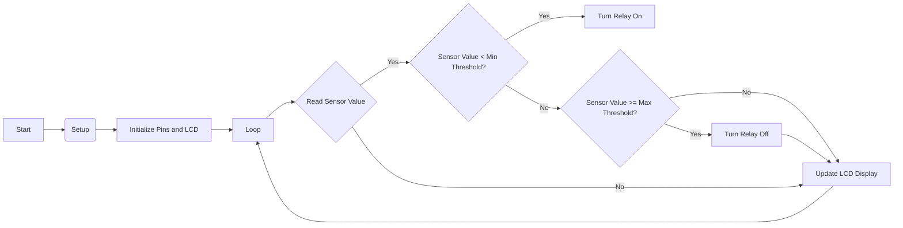

# Soil Moisture Sensor Relay Control with LCD Display
This Arduino sketch demonstrates how to control a relay using a soil moisture sensor and two potentiometers to set the minimum and maximum thresholds for when the relay should turn on or off. The sketch also includes an i2c 1602 LCD display that shows the current sensor value, as well as the minimum and maximum threshold values.

## Requirements
- Arduino Nano
- Soil Moisture Sensor
- Relay Module
- 2 Potentiometers
- i2c 1602 LCD Display
- Jumper Wires

## Circuit Diagram:

1. Connect the soil moisture sensor to the breadboard. Connect the positive (VCC) and negative (GND) leads of the sensor to the corresponding positive and negative rails on the breadboard. Connect the output (S) lead to a digital input pin (e.g. pin 2) on the Arduino Nano.
2. Connect the two potentiometers to the breadboard. Connect the center lead of each potentiometer to an analog input pin (e.g. A0 and A1) on the Arduino Nano. Connect the other two leads of each potentiometer to the positive and negative rails on the breadboard.
3. Connect the relay module to the breadboard. Connect the positive (VCC) and negative (GND) leads of the module to the corresponding positive and negative rails on the breadboard. Connect the input (IN) lead to a digital output pin (e.g. pin 3) on the Arduino Nano.
4. Connect the I2C LCD display to the breadboard. Connect the positive (VCC) and negative (GND) leads of the display to the corresponding positive and negative rails on the breadboard. Connect the SDA (data) and SCL (clock) leads of the display to the corresponding SDA and SCL pins (e.g. A4 and A5) on the Arduino Nano.
5. Connect the positive and negative rails of the breadboard to the corresponding positive (5V) and negative (GND) pins on the Arduino Nano.
In this circuit, the potentiometers act as adjustable resistors that determine the minimum and maximum thresholds for the soil moisture sensor. The soil moisture sensor provides a value that is proportional to the moisture content of the soil. This value is read by the Arduino Nano and compared to the minimum and maximum thresholds set by the potentiometers. If the soil moisture value is below the minimum threshold, the relay is turned on. If the soil moisture value is above the maximum threshold, the relay is turned off. The I2C LCD display is used to display the current soil moisture value, as well as the minimum and maximum thresholds.

## Sketch Explanation

## Libraries
The sketch uses the following libraries:

- Wire.h for I2C communication with the LCD display
- LiquidCrystal_I2C.h for the LCD display

## Variables
The sketch defines the following variables:

```
#define sensorPin A0   // Pin for the soil moisture sensor
#define relayPin 13     // Pin for the relay
#define minPotPin A1   // Pin for the minimum threshold potentiometer
#define maxPotPin A2   // Pin for the maximum threshold potentiometer

LiquidCrystal_I2C lcd(0x27, 16, 2);   // I2C address and dimensions for the LCD display
```

sensorPin is the pin number for the soil moisture sensor
relayPin is the pin number for the relay
minPotPin is the pin number for the minimum threshold potentiometer
maxPotPin is the pin number for the maximum threshold potentiometer
lcd is the instance of the LiquidCrystal_I2C class that is used to communicate with the LCD display

## Setup
The setup function initializes the relay pin as an output and the LCD display:

```
void setup() {
  pinMode(relayPin, OUTPUT);   // Set the relay pin as an output
  lcd.begin();                  // Initialize the LCD display
}
```

## Loop
The loop function reads the values of the soil moisture sensor and the two potentiometers, maps the values from 0 to 100, and sets the relay accordingly:

```
void loop() {
  int sensorValue = map(analogRead(sensorPin), 0, 1023, 0, 100);  // Read the sensor value and map it to 0-100
  int minThreshold = map(analogRead(minPotPin), 0, 1023, 0, 100);  // Read the minimum threshold and map it to 0-100
  int maxThreshold = map(analogRead(maxPotPin), 0, 1023, 0, 100);  // Read the maximum threshold and map it to 0-100

  // If the sensor value is below the minimum threshold, turn the relay on
  if (sensorValue < minThreshold) {
    digitalWrite(relayPin, HIGH);
  }
  // If the sensor value is greater than or equal to the maximum threshold, turn the relay off
  else if (sensorValue >= maxThreshold) {
    digitalWrite(relayPin, LOW);
  }

  lcd.clear();  // Clear the display
  lcd.setCursor(0, 0);  // Set the cursor to the first row, first column
  lcd.print("Value: ");
  lcd.print(sensorValue);
  lcd.print("%");
  lcd.setCursor(0, 1); // Set the cursor to the second row, first column
  lcd.print("Min: ");
  lcd.print(minThreshold);
  lcd.print("% Max: ");
  lcd.print(maxThreshold);
  lcd.print("%");

  delay(500); // Wait for 500 milliseconds
}
```

- `sensorValue` is the current value of the soil moisture sensor, mapped from 0 to 100.
- `minThreshold` is the minimum threshold value set by the minimum threshold potentiometer, mapped from 0 to 100.
- `maxThreshold` is the maximum threshold value set by the maximum threshold potentiometer, mapped from 0 to 100.

The `if` statement checks if the `sensorValue` is less than the `minThreshold`. If it is, the relay is turned on by setting the `relayPin` to `HIGH`. If the `sensorValue` is greater than or equal to the `maxThreshold`, the relay is turned off by setting the `relayPin` to `LOW`.

The LCD display is then updated to show the current `sensorValue`, as well as the `minThreshold` and `maxThreshold`. The display is cleared and the cursor is set to the first row, first column. The current `sensorValue` is printed, followed by the `%` symbol. The cursor is then set to the second row, first column. The text `Min: ` is printed, followed by the `minThreshold` value and the `%` symbol. The text `Max: ` is printed, followed by the `maxThreshold` value and the `%` symbol. The sketch then waits for 500 milliseconds before repeating the loop.

## Flowchart 


